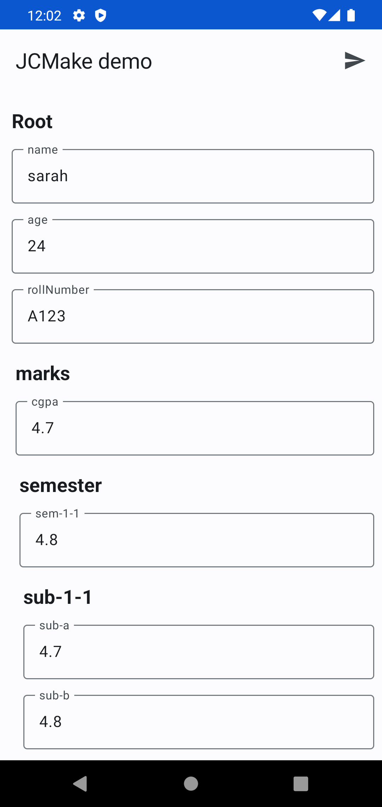
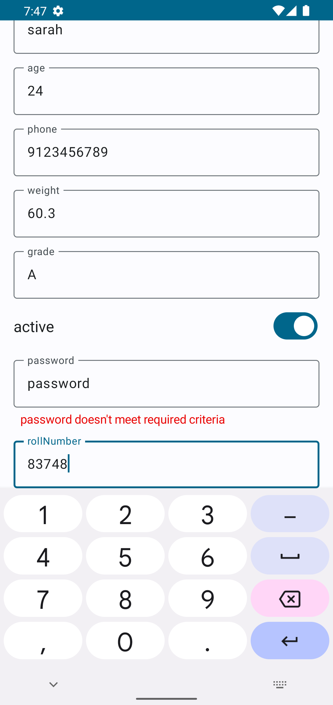
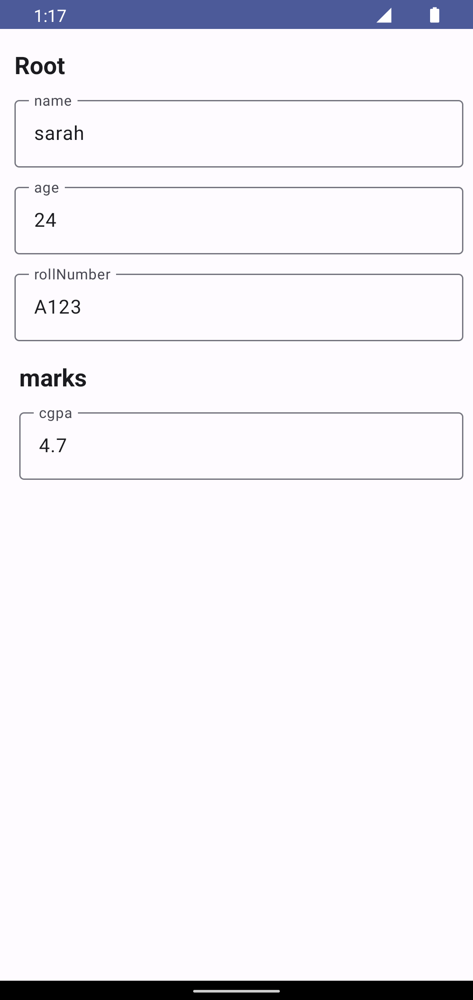
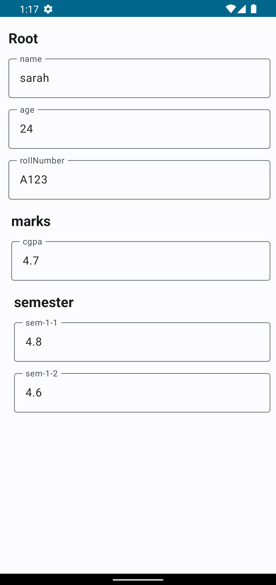
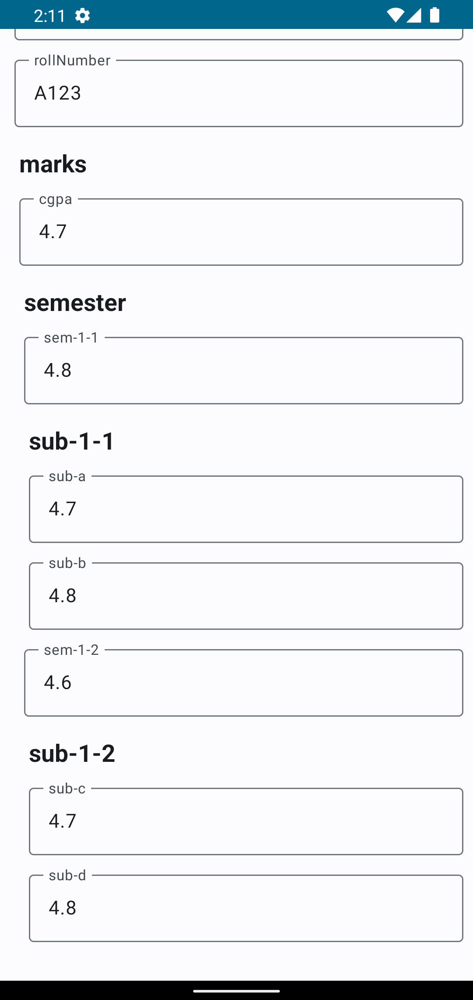
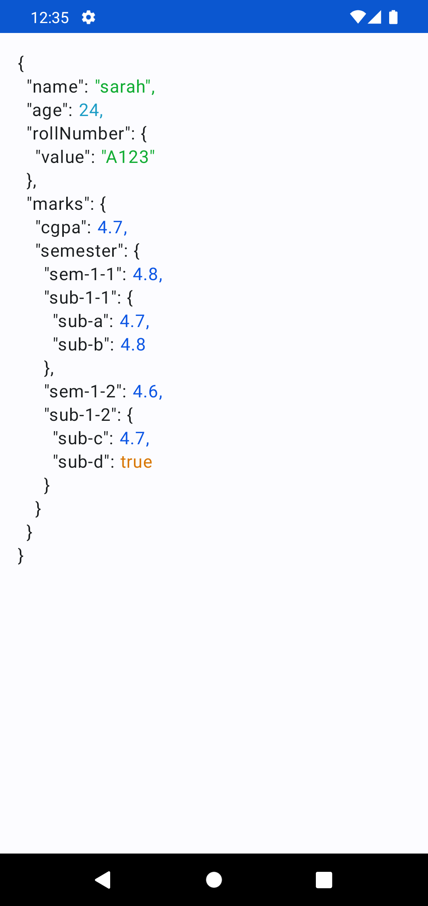

# JCMake

This library takes JSON as input and produces Jetpack Compose's Composables as output.

## Development Environment

   

## Supported Composables

- TextFields
- TextFields with Custom error message
- Switches
- Nested JSON Support
- Pretty JSON

## Installation

Latest version: 

As this library is in development phase as of now, you might need an API_KEY to use this library in
your project. Please reach out to [@fayaz07](https://github.com/fayaz07) for API Key.

After getting the API Key, inside `local.properties` add the below lines.

```properties
gpr.usr=fayaz07
gpr.key=<api_key>
```

Add the below maven tag inside `settings.gradle` file.

```groovy
dependencyResolutionManagement {
  ...
  repositories {
    ...
    maven {
      def localProperties = new Properties()
      localProperties.load(new FileInputStream("local.properties"))

      url = uri("https://maven.pkg.github.com/fayaz07/JCMake")
      credentials {
        username = localProperties["gpr.usr"] ?: System.getenv("USERNAME")
        password = localProperties["gpr.key"] ?: System.getenv("TOKEN")
      }
    }
  }
}
```

Finally, add dependency declaration inside your module's `build.gradle`.

```groovy
dependencies {
  ...
  implementation 'dev.mfayaz:jcmake:0.0.1'
}
```

## Examples and Demo

### Demo app

User will get updates whenever any field is updated, alternatively they can pull latest updates too.
The `Send` button in the demo screenshot will do that.


#### Simple JSON with nested Key-Value and Error values

```json
{
  "name": "sarah",
  "age": 24,
  "phone": 9123456789,
  "weight": 60.3,
  "grade": "A",
  "active": true,
  "password": {
    "value": "password",
    "error": "password doesn't meet required criteria"
  },
  "rollNumber": {
    "value": 83748
  },
  "bmi": {
    "value": 23.4
  }
}
```

#### Output



#### Nested Level - 2

```json
{
  "name": "sarah",
  "age": 24,
  "rollNumber": {
    "value": "A123"
  },
  "marks": {
    "cgpa": 4.7
  }
}
```

#### Output



#### Nested Level - 3

```json
{
  "name": "sarah",
  "age": 24,
  "rollNumber": {
    "value": "A123"
  },
  "marks": {
    "cgpa": 4.7,
    "semester": {
      "sem-1-1": 4.8,
      "sem-1-2": 4.6
    }
  }
}
```

#### Output



#### Nested Level - 4

```json
{
  "name": "sarah",
  "age": 24,
  "rollNumber": {
    "value": "A123"
  },
  "marks": {
    "cgpa": 4.7,
    "semester": {
      "sem-1-1": 4.8,
      "sub-1-1": {
        "sub-a": 4.7,
        "sub-b": 4.8
      },
      "sem-1-2": 4.6,
      "sub-1-2": {
        "sub-c": 4.7,
        "sub-d": 4.8
      }
    }
  }
}
```

#### Output



#### Print JSON to UI

